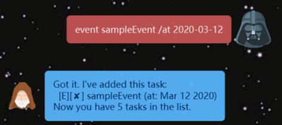
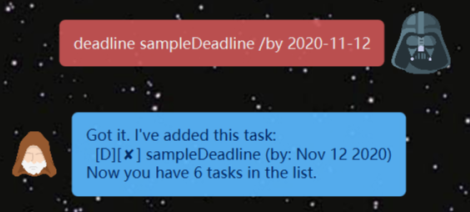
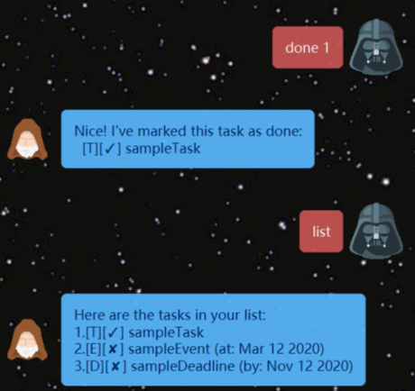
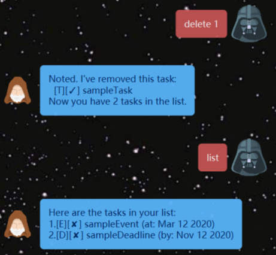
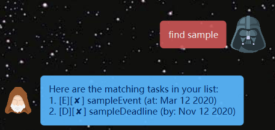
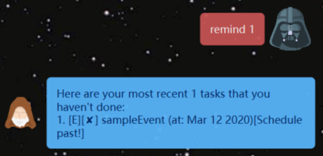

# Duke Chat bot User Guide

## Introduction

Duke chat bot is for people _in need to manage their daily tasks via CLI_.

## Quick Start

* Ensure you have `Java 11` or above installed in your Computer.
* Download latest `duke.jar`.
* Double-click on the `duke.jar` to start the application.
* Exit the app by typing in _"bye"_.  

## Features

1. Add a todo/event/deadline task
1. View the list of tasks
1. Mark certain tasks as completed
1. Delete a task
1. Find a task by keyword
1. Get reminder on upcoming dues  

## Usage

### `Todo` - Add a todo task

Store a todo task which does not have time constraint.

Format: `todo TASK_NAME`

Example of usage: 

* `todo sampleTask` creates the `sampleTask` in the task list.
  

### `Event` - Add an event task

Store an event task which needs to be done __at__ a scheduled time.

Format: `event TASK_NAME /at SCHEDULED_TIME`

* `SCHEDULED_TIME` follows the format _'YYYY-MM-DD'_.

Example of usage: 

* `even sampleEvent /at 2020-03-12` creates the `sampleEvent` in the task list.
* The `sampleEvent` is to be done at __March 12, 2020__.
  

### `Deadline` - Add a deadline task

Store a deadline task which needs to be done __before__ a scheduled time.

Format: `deadline TASK_NAME /by SCHEDULED_TIME`
* `SCHEDULED_TIME` follows the format _'YYYY-MM-DD'_.

Example of usage: 

* `deadline sampleDeadline /by 2020-11-12` creates the `sampleDeadline` in the task list.
* The `sampleDeadline` is to be done before __Nov 12, 2020__.  
  
   
   
   
### `List` - Display the list of tasks

Generates the entire list of tasks stored in the app.

Format: `list`

* The displayed string is of the form `[TASK_TYPE][COMPLETION_INDICATOR]TASK_NAME ([TASK_SCHEDULE])`.
* `TASK_TYPE` can be `T` (Todo) / `E` (Event) / `D` (Deadline).
* `COMPLETION_INDICATOR` shows whether the task has been completed, a `✓` means done, a `✘` means not done.
* `TASK_SCHEDULE` is _optional_.

Example of usage: 

* `list` returns all tasks' information presented nicely.
*   
   
   
   
### `Done` - Complete a task

Mark a task in the list as completed.

Format: `done TASK_INDEX`

* `TASK_INDEX` is an _integer_ between 1 and length of list.

Example of usage: 

* `done 1` updates the status of the first task as "done", represented as `✓`.
*   
   
   
   
### `Delete` - Delete a task

Delete a task in the list by its index.

Format: `delete TASK_INDEX`
* `TASK_INDEX` is an _integer_ between 1 and length of list.

Example of usage: 

* `delete 1` delete the first task from the list.
*   
   
   
   
### `Find` - Search for relevant tasks

Find the tasks containing certain keywords specified by the user.

Format: `find KEYWORD`

* `KEYWORD` is __limited to 1 word__.

Example of usage: 

* `find sample` returns all tasks whose name contain the word `'sample'`.
* Here the outputs are `sampleEvent` and `sampleDeadline`.
*   
   
   
   
### `Reminder` - Get notified of upcoming due

Remind the use the upcoming events/deadlines sorted by their schedule.

Format: `remind TASK_NUMBER`
* `TASK_NUMBER` is amount of upcoming tasks the user wants to know.

Example of usage: 

* `remind 1` returns the earliest 1 task the user hasn't completed.
* If the task's scheduled time has past, the returned task will also indicate it.
* Here the earliest task is `sampleEvet`, which should be done at _March 12, 2020_. The output also shows `[Schedule past!]` to remind user this event has past and not been done.
* 